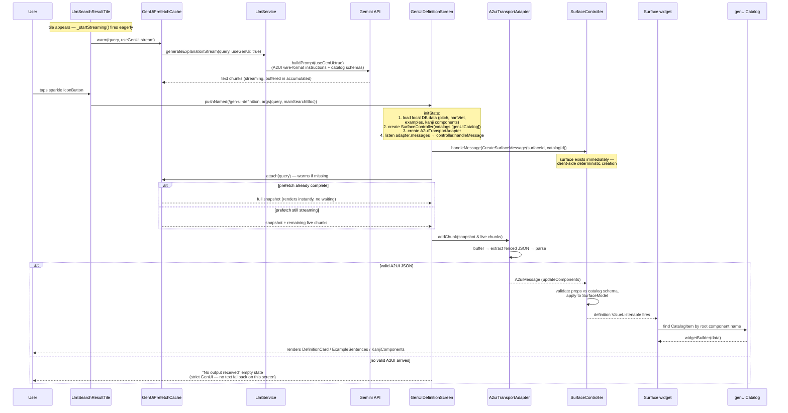

# GenUI / A2UI Integration Guide

This document explains how the `genui` package works, how our app integrates it,
and how every piece communicates from start to finish. It should give a reviewer
enough context to understand all changes made in this feature branch without
reading the package source.

---

## 1. The two packages

| Package | Version | Role |
|---|---|---|
| `a2ui_core` | ^0.1.1 | Protocol engine (pure Dart, no Flutter): message model (`A2uiMessage`, `CreateSurfaceMessage`, ...), `MessageProcessor`, surface/data models, reactivity |
| `genui` | ^0.10.2 | Flutter bindings on top of `a2ui_core`: `SurfaceController`, `Surface` widget, `Catalog`/`CatalogItem` → Widget mapping, transport/parsing utilities |

**Mental model:** the LLM does not send HTML or Flutter code. It sends *declarative
UI descriptions* (A2UI JSON). The client validates those descriptions against a
**catalog** of components it owns, then renders real Flutter widgets from that
catalog. The LLM can never run arbitrary UI — it can only pick components and
fill their properties.

---

## 2. Architecture layers (who talks to whom)

```
┌──────────────────────────────────────────────────────────────────────┐
│  OUR APP CODE                                                        │
│                                                                      │
│  llm_search_result_tile.dart      gen_ui_definition_screen.dart      │
│  (sparkle icon button opens       (full-screen page: Surface +       │
│   the GenUI page; plain tap        local data + LLM gap-fill)        │
│   expands inline text mode)                                          │
│         │                                │                           │
│         │  pushNamed                     │ buildPrompt(useGenUi:true)│
│         ▼                                ▼                           │
│  app_routes.dart                   llm_service.dart                  │
│  (/gen-ui-definition)              (Gemini stream)                   │
│                                          │ chunks                    │
└──────────────────────────────────────────┼──────────────────────────┘
                                           ▼
┌──────────────────────────────────────────────────────────────────────┐
│  genui PACKAGE                                                       │
│                                                                      │
│  A2uiTransportAdapter ──► A2uiParserTransformer                      │
│  (addChunk per stream        (buffers split JSON, extracts fenced    │
│   chunk; emits parsed          ```json blocks, sanitizes stray text) │
│   core.A2uiMessage)                                                  │
│         │                                                            │
│         ▼ incomingMessages                                           │
│  SurfaceController.handleMessage ──► core.MessageProcessor           │
│  (Flutter-side engine:         (a2ui_core: applies create/update/    │
│   buffers updates for            delete ops onto SurfaceModel,       │
│   not-yet-created surfaces,      component tree + DataModel)         │
│   schema-validates payloads,                                         │
│   exposes surfaceUpdates)                                            │
│         │                                                            │
│         ▼ contextFor(surfaceId)                                      │
│  _ControllerContext.definition (ValueListenable<SurfaceDefinition?>) │
│                                                                      │
│  Catalog + CatalogItem  ◄──── name → widgetBuilder mapping           │
└──────────────────────────────────────────────────────────────────────┘
         │
         ▼
┌──────────────────────────────────────────────────────────────────────┐
│  Surface WIDGET (genui/src/widgets/surface.dart)                     │
│  ValueListenableBuilder on definition:                               │
│    - definition == null          → defaultBuilder (loading spinner)  │
│    - no "root" component         → SizedBox.shrink()                 │
│    - unknown catalogId           → FallbackWidget(error)             │
│    - otherwise                   → catalog lookup for root component │
│                                    → item.widgetBuilder(data)        │
│                                    → REAL app widgets                │
│                                      (DefinitionWidget,              │
│                                       ExampleSentenceWidget,         │
│                                       ComponentWidget)               │
└──────────────────────────────────────────────────────────────────────┘
```

Key insight: only the component whose `id` is `"root"` is rendered as the top of
the tree. Everything else must be nested inside it via child properties.

---

## 3. End-to-end sequence (start to finish)



ASCII version (for viewers without Mermaid):

```
Tile appears ──► _startStreaming() ──► GenUiPrefetchCache.warm(query) ──► Gemini (useGenUi prompt)
                                                                              │ chunks buffered in `accumulated`
User tap ──► Tile icon button ──► route /gen-ui-definition ──► Screen.init()  │
                                                                  │           │
   ┌──────────────────────────────────────────────────────────────┤           │
   │ 1. SurfaceController(catalogs: [genUiCatalog])               │           │
   │ 2. A2uiTransportAdapter();                                   │           │
   │    adapter.incomingMessages.listen(controller.handleMessage) │           │
   │ 3. controller.handleMessage(CreateSurface(id, catalogId))    │◄─ deterministic
   │ 4. load local DB data; single fetchWordInfo() gap-fill call  │           │
   │ 5. prefetch.attach(query) ──► snapshot + live chunks ────────┼───────────┘
   └──────────────────────────────────────────────────────────────┤
                                  │
                                  ▼
        attach() output ──► addChunk() ──► [buffer|parse|sanitize] ──┬──► A2uiMessage ──► handleMessage()
                                                                    │                        │
                                                                    ▼                        ▼
                                                          no messages? ──► "No output    Surface widget ──► CatalogItem.widgetBuilder()
                                                                          received"       (root only)         │
                                                                          (strict mode)                      │
                                                                                                             ▼
                                                                                               DefinitionWidget / ExampleSentenceWidget / ComponentWidget
```

---

## 4. The A2UI wire format (v0.9)

Every message is a JSON object **with a top-level `"version": "v0.9"` field**.
`core.A2uiMessage.fromJson` in a2ui_core throws if it is missing or different:

```dart
// a2ui_core-0.1.1/lib/src/core/messages.dart
if (rawVersion != 'v0.9') {
  throw Exception("A2UI message must have version 'v0.9' (got '$rawVersion').");
}
```

The message types used here:

```jsonc
// 1) Client → processor (we send this ourselves, deterministically)
{
  "version": "v0.9",
  "createSurface": { "surfaceId": "llm_definition_surface", "catalogId": "com.jishoanki.dictionary" }
}

// 2) Model → processor (the only thing we ask the model to produce)
{
  "version": "v0.9",
  "updateComponents": {
    "surfaceId": "llm_definition_surface",
    "components": [
      { "id": "root", "component": "DefinitionCard", "senses": [ ... ] }
    ]
  }
}
```

Rules enforced by our prompt (and why):
- `version` must be exactly `"v0.9"` — parser throws otherwise.
- Exactly one component, `id == "root"` — the `Surface` widget renders **only**
  the `root` component; anything else is invisible.
- Property values must be inline literals — `{path: ...}` data references are
  part of the full spec but unnecessary here and error-prone.
- One fenced ```` ```json ```` block, nothing else — the parser transformer
  scans for fenced/balanced JSON; prose around it becomes "sanitized text".

---

## 5. Our catalog (`lib/services/llm/genui_catalog.dart`)

Three `CatalogItem`s map AI-chosen component names to existing app widgets.
Each has a JSON Schema (`json_schema_builder`) used for validation, and a
`widgetBuilder` that converts the raw property map into typed models and
returns a real widget:

| Component name | Renders | Properties |
|---|---|---|
| `DefinitionCard` | `DefinitionWidget` (existing word-definition widget) | `senses[]` (english_definitions, parts_of_speech, tags, info), optional `vietnameseDefinition` |
| `ExampleSentences` | `ExampleSentenceWidget` | `sentences[]` (jpSentence, targetSentence, ...) |
| `KanjiComponents` | `ComponentWidget` (kanji breakdown) | `components[]` (kanji, hanViet, onYomi, kunYomi, keyword, strokeCount) |

```dart
final genUiCatalog = Catalog(
  [definitionCardItem, exampleSentencesItem, kanjiComponentsItem],
  catalogId: genUiCatalogId, // 'com.jishoanki.dictionary'
);
```

**Why the explicit stable `catalogId` matters:** `CreateSurfaceMessage` carries
it, and `Surface._buildDefinitionSurface` looks up the catalog by
`definition.catalogId`. An unknown id ⇒ `FallbackWidget(error)` (blank card).
We initially relied on an auto-generated id which was unstable between the
prompt and client — pinning it to `'com.jishoanki.dictionary'` fixed rendering.
(Also: `effectiveCatalogId` inside the genui package is `@internal`; lib code
must define its own constant.)

The same catalog also feeds the prompt:
`genUiCatalog.toCapabilitiesJson()` → pretty-printed into
`LlmService.buildPrompt(useGenUi: true)` so the model knows exactly which
component names + property schemas are legal.

---

## 6. File-by-file walkthrough of the changes

### `lib/services/llm_service.dart`
- `buildPrompt(String query, {bool useGenUi = false})`
  - `useGenUi: true` → returns the strict A2UI v0.9 instruction prompt
    (envelope template, rules, catalog schema dump).
  - default → the user's custom prompt template from Settings
    (`sharedPref.effectivePrompt` with `%search_words%` substitution).
  - **Deliberately NOT branching on the `llmGenUiEnable` setting anymore**: the
    inline tile expansion must always use the custom settings prompt; only the
    dedicated GenUI screen asks for A2UI output.
- `generateExplanationStream(query, {bool useGenUi = false})` — streams Gemini
  chunks; passes the flag through to `buildPrompt`.
- `fetchWordInfo(query)` — separate non-streaming structured call
  (`responseMimeType: application/json`) returning reading/hanViet/tags/jlpt/
  pitchPattern/example sentences. Used only to fill gaps the local DB cannot.

### `lib/features/main_search/presentation/screens/widgets/llm_search_result_tile.dart`
- Sparkle `IconButton` (leading icon) → `_openGenUiScreen()` → pushes
  `/gen-ui-definition`. This is the **only** entry point to the GenUI screen.
- Any other tap on the tile → `_toggleExpanded()` → inline expand with the
  normal **text-based** streaming output (`HtmlWidget` markdown-lite renderer),
  copy/regenerate buttons, missing-key and error states.
- Streams start eagerly in `initState` (post-frame) so expanded content is
  usually ready instantly. The same hook also pre-warms the GenUI response via
  `getIt<GenUiPrefetchCache>().warm(...)` when `llmGenUiEnable` is on (see the
  pre-warm section below).

### `lib/services/llm/gen_ui_prefetch.dart` — pre-warm technique
Pre-warms the GenUI response so tapping the sparkle button renders with
minimal delay. Without it, every icon-button tap started a **fresh** Gemini
request and the user waited for a full streaming round-trip.

**How it works**
1. The search-result tile calls `_startStreaming()` eagerly in `initState`
   (post-frame). Besides the inline text-mode stream, when `llmGenUiEnable` is
   on it also calls:
   ```dart
   getIt<GenUiPrefetchCache>().warm(
     widget.query,
     startStream: () => llmService.generateExplanationStream(query, useGenUi: true),
   );
   ```
   This starts the A2UI request immediately — before the user ever taps.
2. `GenUiPrefetch` owns that Gemini subscription, concatenates all chunks into
   `accumulated`, tracks `isDone`/`error`, and re-emits each chunk on a broadcast
   `updates` stream.
3. When the user taps the sparkle button, the GenUI screen's `_startStreaming()`
   warms-if-missing then **attaches**: `attach(onChunk, onDone)` atomically
   subscribes to future chunks and returns the current snapshot. The screen
   feeds the snapshot through its transport adapter in one call, keeps listening
   for remaining live chunks, and finishes instantly if the stream is already
   complete. No chunk can be lost or duplicated because snapshot + subscribe
   happen within a single event-loop turn.
4. If no prefetch exists (screen opened without going through the tile), the
   same code path transparently starts a fresh request.

**Design notes**
- Registered as a lazy singleton via GetIt in `injection.dart`
  (`getIt<GenUiPrefetchCache>()`); stateful per-app cache, so a singleton is the
  correct lifetime. Idempotent per query; bounded to 8 entries with FIFO
  eviction (evicted entries are disposed, cancelling their subscriptions).
- Prefetch survives tile disposal, so a completed warm stays reusable if the
  user collapses/re-expands or navigates away and back.
- Trade-off: while a search result tile is visible in GenUI mode there are two
  concurrent requests (inline text-mode stream + pre-warmed A2UI stream). That
  duplication is the price of near-instant results on tap.

### `lib/config/app_routes.dart`
- New route `/gen-ui-definition` (`AppRoutesPath.genUiDefinition`); builder casts
  `state.extra as GenUiDefinitionScreenArgs`.

### `lib/features/main_search/presentation/screens/gen_ui_definition_screen.dart`
The full-screen page. Lifecycle:

1. **Local data first** (`_loadLocalDictionaryData`, mirrors
   `definition_screen.dart`): pitch accent via `KanjiHelper.getPitchAccent`,
   example sentences via `KanjiHelper.getExampleSentence` (localized table with
   English-table fallback), hanViet from bloc's `wordToHanVietMap`, jisho
   definition matched from bloc's `jishoDefinitionList` (word/reading/slug).
2. **LLM gap-fill** (`_fillGapsFromLlm`): one `fetchWordInfo()` call, fired only
   when something is actually missing locally. Effective getters always prefer
   local data over LLM values.
3. **GenUI machinery**:
   - `SurfaceController(catalogs: [genUiCatalog])`,
     `A2uiTransportAdapter()`, wire `adapter.incomingMessages.listen(sc.handleMessage)`.
   - Send `CreateSurfaceMessage(surfaceId: 'llm_definition_surface',
     catalogId: genUiCatalogId)` **before** streaming starts — the surface then
     always exists regardless of what (or whether) the model sends.
   - Stream with `useGenUi: true`; every chunk goes to `adapter.addChunk()`.
4. **Rendering (strict GenUI — no text fallback)**:
   - While streaming with no A2UI content yet → loading indicator.
   - As soon as an `UpdateComponentsMessage` arrives (`_receivedA2uiContent`) →
     `Surface(surfaceContext: sc.contextFor(surfaceId))`.
   - If the stream finishes with zero parsed A2UI messages → plain
     "No output received" empty state. The raw-text fallback from design.md §4
     was intentionally removed once the prompt proved reliable; the inline tile
     expansion still provides the text-mode experience.
5. Layout: AppBar title shows `IsCommonTagsAndJlptWidget` when tag/JLPT/common
   data resolves (bloc first, LLM fallback), else plain text. Body: pitch row →
   big word + reading → hanViet row → divider → AI explanation section
   (the `Surface`) → divider → examples (`ExampleSentenceWidget`) → divider →
   `ComponentWidget(kanjiComponent:)` (strictly local DB, never LLM).

### `pubspec.yaml`
- Added `a2ui_core: ^0.1.1` as a direct dependency (needed for
  `CreateSurfaceMessage` and the `core.` prefix imports).

---

## 7. Gotchas we hit (worth remembering)

1. **Missing `"version": "v0.9"` ⇒ nothing renders.** The original bug. The
   parser throws, and errors inside the adapter pipeline are swallowed
   silently (internal `listen` has no `onError`). Always test prompts against
   the exact envelope above.
2. **Only the `root` component renders.** Multi-component outputs appear blank.
3. **Silent failures.** If the surface stays empty, check, in order:
   `surfaceController.activeSurfaceIds`, whether `createSurface` was sent, the
   prefetch's `accumulated` string for a fenced JSON block (inspect it via a
   breakpoint in `GenUiPrefetch._append`), and `flutter run` logs for
   validation warnings.
4. **Stable catalog id required**, see §5.
5. **FutureBuilder identity matters.** Widgets like `ExampleSentenceWidget`
   animate in `initState`. Passing `Future.value(x)` inline recreates the future
   on every rebuild ⇒ every streamed chunk reset the FutureBuilder and replayed
   entry animations. Fix: cache the future in State (`_examplesFuture`) and only
   replace it when the underlying data genuinely changes. `ComponentWidget` was
   already safe because it consumes the stable `_kanjiListFuture` field.
6. **Prompt routing is caller-driven.** `useGenUi` flag, not the settings flag,
   decides which prompt is used — keeps inline text mode and GenUI mode
   independent.

---

## 8. Testing

- `test/genui_catalog_test.dart` — each `CatalogItem` builds its target widget
  from sample data; catalog contains all three items.
- `test/genui_surface_test.dart` — integration: controller init, create-surface
  flow, `A2uiTransportAdapter` parsing of full and chunk-split messages.

Run:

```powershell
flutter test test\genui_surface_test.dart test\genui_catalog_test.dart
```

## 9. Where to look in the package sources

Pub cache paths, useful when debugging:

```
%LOCALAPPDATA%\Pub\Cache\hosted\pub.dev\genui-0.10.2\lib\src\
  ├─ widgets\surface.dart                    # rendering rules (root-only, fallbacks)
  ├─ engine\surface_controller.dart          # pending-update buffering, validation
  ├─ transport\a2ui_transport_adapter.dart   # addChunk / incomingMessages API
  ├─ transport\a2ui_parser_transformer.dart  # fenced-JSON extraction from streams
  └─ model\catalog.dart, model\catalog_item.dart

%LOCALAPPDATA%\Pub\Cache\hosted\pub.dev\a2ui_core-0.1.1\lib\src\
  ├─ core\messages.dart                      # A2uiMessage.fromJson (version check!)
  ├─ processing\processor.dart               # MessageProcessor state machine
  └─ core\component_model.dart, surface_model.dart
```
